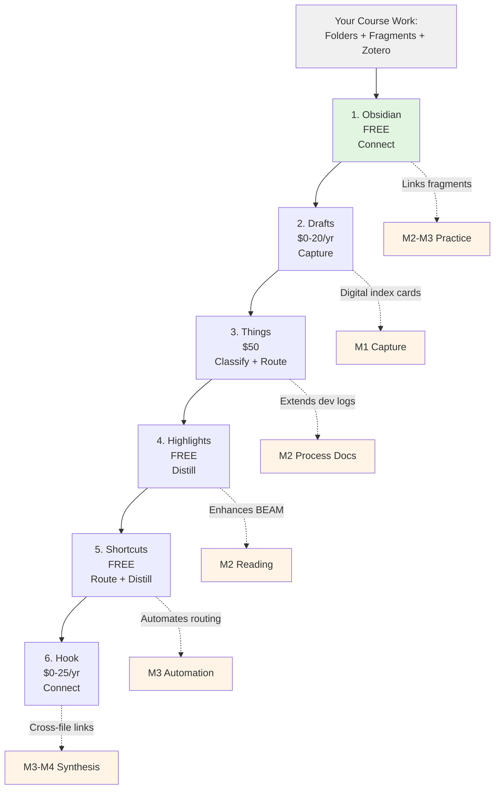
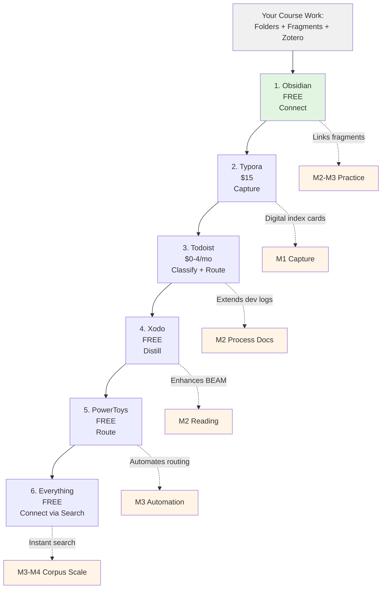

# Week 15: Exit Strategies—Building on What You've Learned

> [!info] Course Content
> **Component**: Week 15 (Final Materials)
> **Track**: Content (student handout)
> **Paired with**: [[exit-strategies-week15-reasons-v101|Justification]]
> **Status**: Ready for distribution
> **Format**: Two-sided PDF (macOS / Windows)

---

## Purpose

This handout maps **six tools per platform** that extend the tech stack you developed this semester. These aren't radical departures—they build directly on the skills you've practiced: capturing ideas, organizing fragments, managing sources, documenting process, and operating at scale.

You've already invested in:
- A folder structure that works
- Naming conventions that make sense
- Zotero libraries with BEAM-tagged sources
- Habits of process documentation
- An accumulated corpus of 40+ fragments

**The tools below protect that investment** while expanding what you can do with it.

---

## How to Use This Guide

**Learn in sequence.** Start with Tool #1 (Obsidian) because it becomes your hub—where everything else connects. Then add tools in order as you need them, not all at once.

**Connect to course concepts.** Each tool extends a specific **Move** from our six-move vocabulary (Capture → Classify → Route → Distill → Connect → Publish) and builds on practices from specific **Movements** (M1: Surfacing, M2: Naming, M3: Operating at Scale, M4: Synthesis).

**Budget strategically.** Total cost ranges from ~$15 (Windows, using free tiers) to ~$95 (macOS, buying everything). But you don't need everything immediately. Start with the free tools and add others as specific needs arise.

---

# macOS Tools



---

## 1. Obsidian (Free)

**Extends**: Folder structure (M2), fragment linking (M2-M4)  
**Primary Move**: **Connect**  
**URL**: [obsidian.md](https://obsidian.md)

### What It Does

Transforms your OneDrive folders into a **linked knowledge graph**. Your fragments become nodes you can link together and visualize. Every `[[link]]` you create in one note becomes a clickable connection in another.

### Builds On Course Practice

- Your existing folder structure (`01-Fragments/M1-Surfacing/`, etc.) works as-is
- Your YAML-MM-DD naming convention enables chronological sorting
- Your BEAM tags become searchable, linkable concepts
- Your dev logs become navigable process documentation

### Start Here Because

Everything else connects through Obsidian. It's your hub.

---

## 2. Drafts (Free tier / $20/year Pro)

**Extends**: Index cards (M1)  
**Primary Move**: **Capture**  
**URL**: [getdrafts.com](https://getdrafts.com)

### What It Does

Ultra-fast text capture that can route to Obsidian automatically. Think "digital index card that knows where to go." Open the app, start typing—no file management, no decisions. Process later.

### Builds On Course Practice

- Same "one idea per card" principle from M1
- Same "capture now, classify later" workflow
- Your tagging conventions work in Drafts
- Can route captures to specific Obsidian folders via actions

### When to Add

When you're capturing ideas outside class—reading on the bus, thinking in the coffee shop, working on other courses—and want index-card speed without physical cards.

---

## 3. Things ($50 one-time)

**Extends**: Dev logs (M2)  
**Primary Move**: **Classify + Route**  
**URL**: [culturedcode.com/things](https://culturedcode.com/things)

### What It Does

Transforms your dev log practice into full project management. Track writing projects, revision tasks, and reading goals with the same "what/happened/learned" reflection structure you used in dev logs.

### Builds On Course Practice

- Projects mirror your M1-M4 folder structure
- Tasks use same status codes (draft → revised → polished)
- Daily review replaces your twice-weekly dev log entries
- Links directly to Obsidian notes for each task

### When to Add

When you're juggling multiple writing projects (M2-M3 transition) and need more structure than dev logs provide. Especially useful if taking multiple writing-intensive courses.

**Note**: Todoist ([todoist.com](https://todoist.com), $4/month student) is a solid cross-platform alternative at lower cost if you need Windows/Android compatibility.

---

## 4. Highlights (Free)

**Extends**: Zotero reading (M2)  
**Primary Move**: **Distill**  
**URL**: [highlightsapp.net](https://highlightsapp.net)

### What It Does

Extract and annotate PDFs with exports to markdown. Turns your BEAM tagging into actionable highlights you can link from Obsidian. Every highlight becomes a fragment you can route and connect.

### Builds On Course Practice

- BEAM tags transfer directly (tag highlights as B/E/A/M)
- Exports match your fragment format (one claim + evidence)
- Links back to original PDF page numbers
- Integrates with Zotero library structure

### When to Add

When you're reading more complex sources in upper-division courses and need to extract 10-15 highlights per source rather than 2-3. Turns passive highlighting into active note-taking.

**Alternative**: Skim ([skim-app.sourceforge.io](https://skim-app.sourceforge.io)) is free and does similar work with slightly more manual export.

---

## 5. Shortcuts (Free, built into macOS)

**Extends**: "What You're Automating" (M3)  
**Primary Move**: **Route + Distill**  
**URL**: Built into macOS (System Settings → Shortcuts)

### What It Does

Automate the repetitive parts of your workflow—creating dated notes, formatting fragments, moving files between folders. The "never do twice what you can automate" principle from M3.

### Builds On Course Practice

- Automates your YYYY-MM-DD naming convention
- Creates new fragments with YAML frontmatter pre-filled
- Routes captures from Drafts to correct Obsidian folders
- Batch-renames files according to your conventions

### When to Add

When repetitive tasks start annoying you (mid-M3)—creating 4 fragments per week with identical setup, moving files between folders, reformatting text into your conventions.

### Example Shortcuts You Could Build

- "New Fragment" → prompts for topic, creates `YYYY-MM-DD-topic-draft.md` in correct folder
- "File to M2" → moves selected file to M2-Naming folder, updates status code
- "Dev Log Entry" → creates today's dated entry with template structure

---

## 6. Hook ($0 free tier / $25/year Pro)

**Extends**: Corpus connections (M3-M4)  
**Primary Move**: **Connect**  
**URL**: [hookproductivity.com](https://hookproductivity.com)

### What It Does

Create **bidirectional links between ANY files**—PDFs, notes, tasks, emails, browser tabs. Builds on the "everything connects to everything" principle from the course. Hook asks "what else is related to this?" and remembers your answer.

### Builds On Course Practice

- Extends your Obsidian `[[wiki-links]]` beyond text files
- Creates connections between Zotero PDFs and Obsidian notes
- Links Things tasks to the fragments they're about
- Preserves relationships when files move/rename

### When to Add Last

Because it's most powerful when you have substantial material to connect (M4 synthesis work). Hook becomes your "process archaeology" tool—trace how a finished piece connects back through drafts, sources, dev logs, and initial captures.

---

# Windows Tools



---

## 1. Obsidian (Free)

**Extends**: Folder structure (M2), fragment linking (M2-M4)  
**Primary Move**: **Connect**  
**URL**: [obsidian.md](https://obsidian.md)

### What It Does

Transforms your OneDrive folders into a **linked knowledge graph**. Your fragments become nodes you can link together and visualize. Every `[[link]]` you create in one note becomes a clickable connection in another.

### Builds On Course Practice

- Your existing folder structure (`01-Fragments/M1-Surfacing/`, etc.) works as-is
- Your YAML-MM-DD naming convention enables chronological sorting
- Your BEAM tags become searchable, linkable concepts
- Your dev logs become navigable process documentation

### Start Here Because

Everything else connects through Obsidian. It's your hub.

---

## 2. Typora ($15 one-time)

**Extends**: Index cards (M1)  
**Primary Move**: **Capture**  
**URL**: [typora.io](https://typora.io)

### What It Does

Minimal markdown editor for quick, low-friction writing. Saves directly to your Obsidian folder. Think "digital index card with no interface getting in the way." No menus, no buttons—just you and the text.

### Builds On Course Practice

- Same "one idea per card" principle from M1
- Same YYYY-MM-DD naming you already use
- Saves automatically to your folder structure
- Markdown syntax you learned in Obsidian

### When to Add

When you want faster capture than opening Obsidian and navigating folders—especially for quick reading notes, lecture captures, or idea jots between classes.

**Alternatives**: 
- Simplenote ([simplenote.com](https://simplenote.com), free) for even simpler capture
- Notion ([notion.so](https://notion.so), free for students) if you want more structure (though it's more complex)

---

## 3. Todoist (Free tier / $4/month for students)

**Extends**: Dev logs (M2)  
**Primary Move**: **Classify + Route**  
**URL**: [todoist.com](https://todoist.com)

### What It Does

Project and task management that can link to your Obsidian notes. Organizes writing projects with the same categories/status codes you learned for fragments. Cross-platform, so works on any device.

### Builds On Course Practice

- Projects mirror your M1-M4 folder structure
- Labels match your status codes (draft/revised/polished)
- Daily/weekly review replaces dev log entries
- Can link tasks to specific Obsidian notes

### When to Add

When juggling multiple writing projects and need more structure than dev logs provide. The student discount makes the premium tier ($4/month) affordable for features like reminders and file uploads.

---

## 4. Xodo (Free)

**Extends**: Zotero reading (M2)  
**Primary Move**: **Distill**  
**URL**: [xodo.com](https://xodo.com)

### What It Does

Annotate and highlight PDFs with exports to text. Turns your BEAM tagging into extractable notes you can incorporate into Obsidian. Every highlight becomes a fragment.

### Builds On Course Practice

- BEAM tags work as highlight colors or comments
- Export annotations as text (one claim + evidence format)
- Integrates with Zotero's file structure
- Free cloud sync across devices

### When to Add

When reading complex sources in upper-division courses and need to extract 10-15 highlights per source. Makes the jump from "highlighting while reading" to "notes you can work with."

**Alternative**: Drawboard PDF ([drawboard.com](https://drawboard.com)) has free basic version with good annotation tools.

---

## 5. PowerToys (Free, official Microsoft tool)

**Extends**: "What You're Automating" (M3)  
**Primary Move**: **Route**  
**URL**: [microsoft.com/powertoys](https://docs.microsoft.com/windows/powertoys/)

### What It Does

Suite of Windows utilities including quick text capture (Text Extractor), bulk file renaming (PowerRename), keyboard shortcuts (Keyboard Manager), and more. The "never do twice what you can automate" principle from M3.

### Builds On Course Practice

- **PowerRename**: Batch-update filenames to match your YYYY-MM-DD convention
- **Text Extractor**: Quick capture of text from anywhere (like screenshots of quotes)
- **FancyZones**: Window management for split-screen writing + research
- **Keyboard Manager**: Custom shortcuts for your most-used Obsidian commands

### When to Add

When repetitive tasks start annoying you (mid-M3)—renaming multiple files, capturing text from PDFs, managing windows during research sessions.

### Start With These PowerToys

1. **PowerRename** for batch file operations
2. **Text Extractor** (Win+Shift+T) for quick capture
3. **FancyZones** for workspace layouts

---

## 6. Everything (Free)

**Extends**: Corpus search (M3-M4)  
**Primary Move**: **Connect** (via search)  
**URL**: [voidtools.com](https://voidtools.com)

### What It Does

**Instant search** across all your files. Find any fragment in under a second by filename, date, content, or tag. Makes "operating at scale" (M3) actually manageable when you have 50+ fragments across multiple folders.

### Builds On Course Practice

- Your YYYY-MM-DD naming makes date searches powerful
- Your folder structure becomes searchable navigation
- Your status codes enable filtering (show me all "draft" files)
- Your BEAM tags become instant filters

### When to Add Last

Because it's most powerful when you have substantial corpus (M4 synthesis work). Everything becomes your "process archaeology" tool—instantly find that fragment you wrote in February about a specific concept.

### Power User Tips

- Search by date range: `2026-02-01..2026-02-28`
- Search by folder: `M2-Naming\ *.md`
- Search by status: `*-draft.docx`
- Combine: `2026-02 M2-Naming draft` finds all M2 drafts from February

---

# Learning Path Strategy

## Semester 1 (This Course + Immediate Next)

**Install now**:
- Obsidian (both platforms)

**Add by Week 4 of next semester**:
- Capture tool (Drafts/Typora)
- Task management (Things/Todoist)

## Semester 2-3 (Sophomore Year)

**Add when reading load increases**:
- PDF annotation (Highlights/Xodo)

**Add when juggling 3+ writing projects**:
- Automation tools (Shortcuts/PowerToys)

## Semester 4+ (Junior/Senior)

**Add for thesis/capstone work**:
- Advanced connection tools (Hook/Everything)
- Consider full research management suite

---

# Mapping to the Six Moves

| Move | macOS Tool | Windows Tool | Extends From Course |
|------|-----------|--------------|---------------------|
| **Capture** | Drafts | Typora | M1 index cards, freewriting |
| **Classify** | Things (Projects) | Todoist (Projects) | M2 BEAM tags, dev logs |
| **Route** | Shortcuts | PowerToys | M3 folder structure, automation |
| **Distill** | Highlights | Xodo | M2 source engagement, BEAM |
| **Connect** | Obsidian + Hook | Obsidian + Everything | M2-M4 linking, synthesis |
| **Publish** | (Course already taught this: Word + Eli Review) | (Course already taught this: Word + Eli Review) | M4 portfolio |

---

# Cost Summary

## macOS Path

| Tool | Cost | When to Buy |
|------|------|-------------|
| Obsidian | Free | Now |
| Drafts | Free tier → $20/yr Pro | Start free, upgrade if you love it |
| Things | $50 one-time | When juggling 3+ projects |
| Highlights | Free | When PDF reading intensifies |
| Shortcuts | Free (built-in) | Explore anytime |
| Hook | Free tier → $25/yr Pro | Save for later (junior year+) |

**Total if buying everything**: ~$70-95  
**Total strategic path**: $0 → $20 → $70 over 2-3 semesters

---

## Windows Path

| Tool | Cost | When to Buy |
|------|------|-------------|
| Obsidian | Free | Now |
| Typora | $15 one-time | After trying free alternatives |
| Todoist | Free tier → $4/mo student | Start free, upgrade for features |
| Xodo | Free | When PDF reading intensifies |
| PowerToys | Free (Microsoft) | Anytime |
| Everything | Free | Now (it's that useful) |

**Total if buying everything**: ~$15-63/year  
**Total strategic path**: $0 → $15 → $48/yr over 2-3 semesters

---

# Protection Against Tool Failure

Remember **Graceful Degradation** (M3 principle): your core work—the folder structure, the naming conventions, the fragments themselves—exists as plain text files and Word documents. These tools enhance your workflow but don't hold your work hostage.

**If any tool stops working**:
- Your files remain accessible in OneDrive/File Explorer
- Your Zotero library is independent
- Your fragments are readable in any text editor
- Your connections exist in human-readable `[[links]]`

This is why we started with proven, low-tech foundations. The tools amplify your work; they don't replace your agency.

---

# Where to Learn More

**Obsidian**: 
- Official documentation: [help.obsidian.md](https://help.obsidian.md)
- Forum: [forum.obsidian.md](https://forum.obsidian.md)
- r/ObsidianMD community

**General Workflow Design**:
- Forte Labs' "Building a Second Brain" course (free intro: [fortelabs.com](https://fortelabs.com))
- "How to Take Smart Notes" by Sönke Ahrens (book)
- Obsidian university courses (some free, some paid)

**Remember**: You don't need to become a "power user" of any of this. Use what serves your writing. Ignore what doesn't. The goal is **writing better**, not **managing tools**.

---

# Final Course Principle

> "Never do twice what you can automate—but automation should feel like a capable assistant awaiting instructions, not an agent acting independently."

You learned this in M3. These tools embody it. They prepare and propose; you confirm and trigger. Your judgment remains central.

Good luck with your writing. The corpus you've built this semester is real intellectual capital—keep investing in it.

---

## Related Content

```dataview
TABLE component, status, identifier
FROM "600_teaching/virens_101"
WHERE type = "teaching-course-content"
  AND (contains(identifier, "week15") OR contains(identifier, "tech") OR contains(identifier, "automation"))
  AND file.name != this.file.name
SORT component ASC
```

---

## Paired Justification

**See**: [[exit-strategies-week15-reasons-v101]]

---

*Created: 2026-01-21*  
*Component: Week 15 (Exit Materials)*  
*Course: VIRENS 101*
